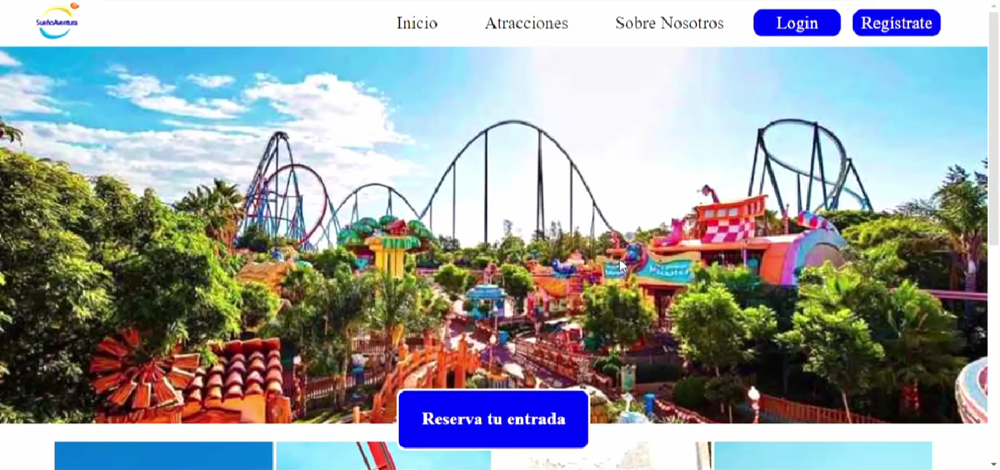

<h1 align="center">Proyecto final bootcamp Full Stack Developer</h1>
<h2 align="center">Frontend de un parque temático ficticio</h2>

## Tabla de contenidos 📝

- <a href="#objetivo">Objetivo</a>
- <a href="#referencias">Referencias</a>
- <a href="#tecnologías-utilizadas">Stack - Tecnologías utilizadas</a>
- <a href="#desarrollo">Desarrollo</a>
- <a href="#desarrollo">Cómo funciona</a>
- <a href="#contribuciones">Contribuciones</a>
- <a href="#agradecimientos">Agradecimientos</a>
- <a href="#contacto">Contacto</a>
- <a href="#licencia">Licencia</a>


## Objetivo
El objetivo de este proyecto ha sido el de maquetar un frontend que sea capaz de atacar a la <a href="https://github.com/hmateu/backendFinalProjectPhp.git">API que he desarrollado para este mismo fin</a>. De esta manera me he puesto a prueba, consolidando conocimientos que he ido adquiriendo durante el bootcamp de full stack developer que he cursado.



<div align="center">🚀<a href="https://frontend-final-project-react.vercel.app/">Visita la página web</a>🚀</div>

## Referencias
Para el diseño de la aplicación, me he basado en gran parte en la estética de <a href="https://www.portaventuraworld.com/portaventura">PortAventura</a>. Por otra parte, he realizado un trabajo de observación de otras páginas web de parques temáticos como son La Warner y Terra Mítica para poder hacer un diseño propio.

## Tecnologías utilizadas
             

## Desarrollo
Este proyecto está desarrollado en **REACT** y cuenta con **Redux, HTML5, CSS3 y javaScript**. Para la edición de las imágenes, he utilizado **Adobe Photoshop CC 2019** y para el desarrollo del código **Visual Studio Code**.
La página web es totalmente responsive, gracias a la utilización de media queries en puntuales elementos.

## Cómo funciona
La página web es navegable de distintos modos, cada uno con más acceso y permisos que los anteriores. Puedes navegar por la web sin estar logueado, loguearte como cliente o como administrador.

- **Como invitado:** Solamente podrás realizar 4 acciones:
    **1.** Ver todas las atracciones que tiene el parque y su vista detalle
    **2.** Ver la página "Sobre nosotros"
    **3.** Loguearte, si previamente te has registrado
    **4.** Registrarte como cliente
- **Como cliente:** Podrás realizar un par de acciones más.
    **1.** Ver tus datos de perfil y modificarlos
    **2.** Ver mis entradas y comprar nuevas
- **Como administrador:** Tienes acceso total mediante un panel de administrador
    **1.** Ver todos los usuarios registrados en le base de datos
    **2.** Eliminar cualquier usuario
    **3.** Registrar un nuevo usuario
    **4.** Ver todas las atracciones, pero con los empleados asignados a cada una de ellas
    **5.** Ver todas las entradas que se han comprado
    **6.** Eliminar cualquier entrada


## Contribuciones
Las sugerencias y aportaciones son siempre bienvenidas.  

Puedes hacerlo de dos maneras:

**1.** Abriendo una issue
**2.** Crea un fork del repositorio
    - Crea una nueva rama  
        ```
        $ git checkout -b feature/nombreUsuario-mejora
        ```
    - Haz un commit con tus cambios 
        ```
        $ git commit -m 'feat: mejora X cosa'
        ```
    - Haz push a la rama 
        ```
        $ git push origin feature/nombreUsuario-mejora
        ```
    - Abre una solicitud de Pull Request

## Agradecimientos
Agradezco a mis profesores el tiempo dedicado a este proyecto y a mis compañeros por sus consejos y apoyo. Sin esta ayuda no lo hubiera conseguido en el tiempo estipulado.

- **Dani**  
<a href="https://github.com/Datata" target="_blank"></a> 

- **David**  
<a href="https://github.com/Dave86dev" target="_blank"></a>

- **Mara**  
<a href="https://github.com/MaraScampini" target="_blank"></a>

- **Jose**  
<a href="https://github.com/JoseMarin" target="_blank"></a>

## Contacto
<a href = "mailto:hmateu.ortola@gmail.com"></a> <a href="https://www.linkedin.com/in/h%C3%A9ctor-mateu-ortol%C3%A1-278b92160/" target="_blank"></a> 
## Licencia
- Este proyecto se ha realizado bajo la **licencia MIT**.
- Las imágenes utilizadas en el desarrollo de este proyecto son propiedad de los distintos parques temáticos como PortAventura y Terra Mítica.